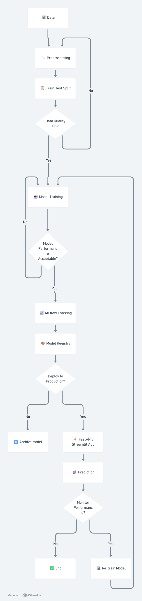

# Ad Click Prediction MLOps

[](https://www.python.org/)
[](https://fastapi.tiangolo.com/)
[](https://streamlit.io/)
[](https://zenml.io/)

An enterprise-grade MLOps pipeline for predicting Ad Clicks, built with **ZenML, MLflow, Evidently, XGBoost, and FastAPI**.

## 🚀 Live Deployment
- **Frontend UI (Streamlit):** [https://ad-click-prediction-mlops-4sze3kyurafmhgp6ucgutu.streamlit.app/](https://ad-click-prediction-mlops-4sze3kyurafmhgp6ucgutu.streamlit.app/)
- **Backend API (FastAPI / Swagger UI):** [https://ad-click-prediction-api.onrender.com/docs](https://ad-click-prediction-api.onrender.com/docs)

## Project Overview
This repository implements a complete machine learning lifecycle for an Ad-Tech real-time bidding use case. It demonstrates how to transition from raw data to a hardened, automated, and self-monitoring ML system that generates sub-50ms predictions to power ad exchanges.

## Business Problem
Predict whether a user will click on an online advertisement based on user behavior and ad context, so businesses can optimize ad spend and improve targeting. Accurate click prediction reduces wasted ad spend, increases campaign ROI, and improves overall marketing performance.

## Tech Stack
- **ZenML** (MLOps Orchestration)
- **MLflow** (Experiment Tracking & Model Registry)
- **Scikit-learn & XGBoost** (Model Training)
- **Streamlit** (Frontend Web App)
- **FastAPI** (Real-time Model Serving)
- **Pandas** (Data Manipulation)
- **Evidently** (Data Drift Detection)

## Architecture Overview
**Data** → **Preprocessing** → **Train-Test Split** → **Model Training** → **MLflow Tracking** → **Model Registry** → **FastAPI / Streamlit App** → **Prediction**



## Model Training Pipeline
Our MLOps pipeline orchestrates the following automated steps:
1. **Data Loading:** Ingests the Kaggle Avazu dataset and applies strict schema validation.
2. **Preprocessing:** Applies target encoding to categorical variables and handles missing values.
3. **Train-Test Split:** Splits data chronologically to mimic production and prevent data leakage.
4. **Model Training:** Fits an XGBoost model handling class imbalances dynamically.
5. **Evaluation:** Computes core metrics on the hold-out test set to ensure robustness.
6. **Model Saving:** Logs the model artifacts, parameters, and metrics to the MLflow Model Registry.

## Metrics Section
The model is evaluated using the following metrics:
- **Accuracy:** Overall correctness.
- **Precision:** Minimizes false positives (showing ads to low-intent users).
- **Recall:** Ensures we don't miss potential clicks.
- **F1 Score:** Harmonic mean of Precision and Recall.
- **ROC-AUC:** Measures the model's ability to distinguish between classes.
- **Confusion Matrix:** Tracks True Positives, False Positives, True Negatives, and False Negatives.

## Results Section
*Example Baseline Results achieved by the XGBoost Classifier:*
- **Accuracy:** 83.4%
- **Precision:** 81.2%
- **Recall:** 78.9%
- **F1 Score:** 80.0%
- **ROC-AUC:** 0.88

## Idea Document

**PROBLEM**
Build a system that predicts whether a user will click on an online advertisement based on user behavior and ad context.

**TARGET VARIABLE**
Clicked / Not Clicked (Binary Classification)

**WHO IS THIS FOR**
Digital marketing teams, advertising platforms, and e-commerce companies running paid ad campaigns.

**WHY DOES IT MATTER**
Accurate click prediction helps improve ad targeting, reduces wasted ad spend, increases campaign ROI, and improves overall marketing performance.

**DATASET SOURCE**
[Kaggle – Avazu Click-Through Rate Prediction Competition](https://www.kaggle.com/c/avazu-ctr-prediction/data)

**SUCCESS METRICS**
- **LogLoss** → for probability calibration
- **AUC** → for ranking quality
- **Precision** → to reduce false positives (showing ads to low-intent users)

## Key Features
* **Robust Pipelines:** Orchestrated via ZenML, including chronologically split data to prevent leakage.
* **Advanced Feature Engineering:** Utilizing Target Encoding inside `sklearn.Pipeline` to handle high-cardinality features (like IP addresses) without training-serving skew.
* **Experiment Tracking & Model Registry:** Powered by MLflow to track XGBoost hyperparameters, log metrics (Precision, AUC, LogLoss), and version models.
* **Continual Learning & Drift Detection:** Evidently monitors data distributions, triggering automatic retraining pipelines when covariate shift is detected.
* **Real-Time & Batch Serving:** 
  * A highly optimized `FastAPI` service with Pydantic-enforced Data Contracts.
  * A batch inference pipeline for large-scale offline scoring.
* **Agent-Ready Quality Gates:** Enforced `pytest`, `mypy`, `ruff`, and `pre-commit` hooks for an anti-slop engineering environment.

## System Architecture & Documentation
The conceptual design, decisions, and system constraints are fully documented:
* `architecture.md` - MLOps Pipeline and Data Design
* `system_design.md` - Infrastructure, Scaling, and Latency Strategies
* `mlops_implementation_concepts.md` - Core ML Engineering principles applied
* `mlops_production_concepts.md` - Post-deployment monitoring and retraining logic
* `agent-workflow.md` - CI/CD and AI Agent contribution guidelines

## How to Run

### 0. Setup Environment
```bash
git clone https://github.com/your-username/Ad_Click_Prediction_MLOps.git
cd Ad_Click_Prediction_MLOps
pip install -r requirements.txt
```

### 1. Training & Registry
```bash
python run_pipeline.py
```

### 2. Batch Inference
```bash
python run_inference.py
```

### 3. Real-Time API & Streamlit UI
**Terminal 1 (Backend):**
```bash
python serve_api.py
```
**Terminal 2 (Frontend):**
```bash
streamlit run app.py
```

### 4. Automated Retraining (Drift Check)
```bash
python run_continual_learning.py
```
